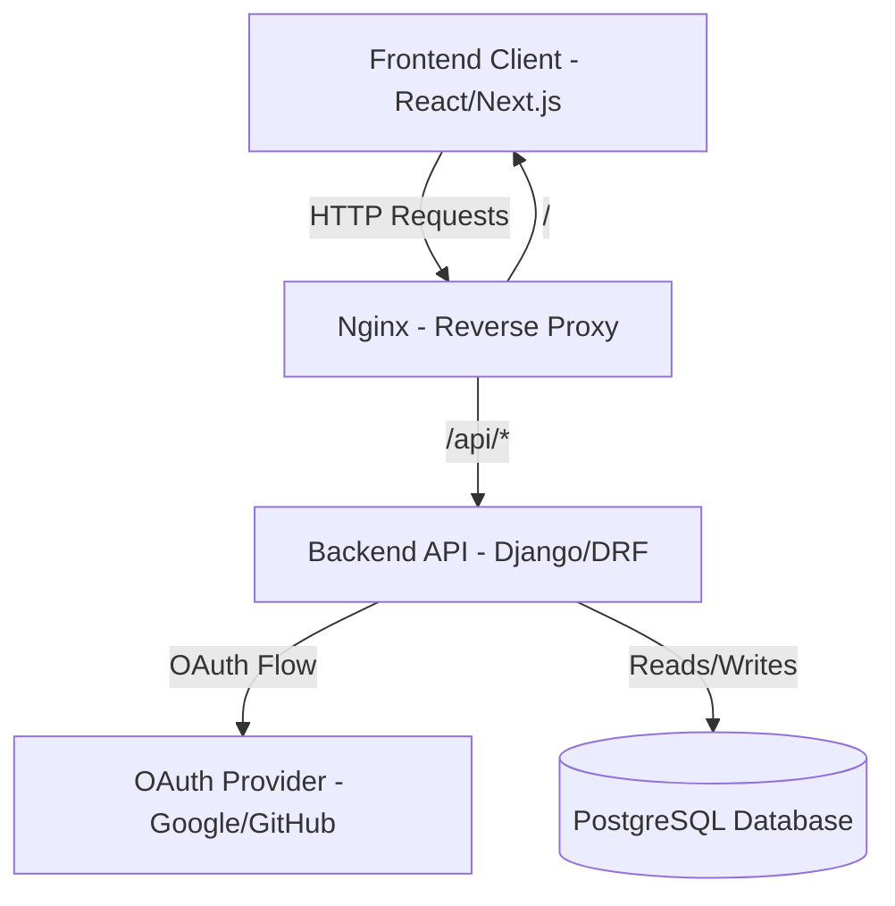
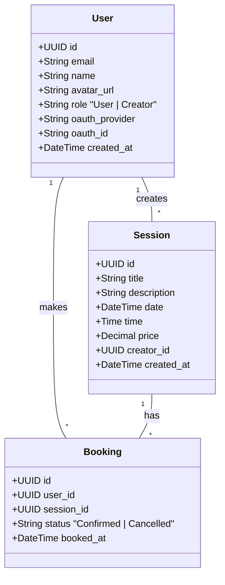

# Ahoum SpiritualTech - Sessions Marketplace

## Overview
A web application where users can sign in via OAuth, browse sessions, and book them. Built with React (or Next.js) for the frontend, Django + Django REST Framework for the backend, and PostgreSQL for the database, all containerized with Docker.

## Tech Stack
- **Frontend**: React / Next.js
- **Backend**: Django + Django REST Framework
- **Database**: PostgreSQL
- **Infrastructure**: Docker (multi-container: frontend, backend, database, Nginx reverse proxy)
- **Authentication**: OAuth (Google or GitHub) with JWT tokens

## Architecture



## Database Schema / Class Diagram



## System Requirements & Prerequisites
Before installing on any system, ensure you have the following tools installed:
- **Docker**: [Install Docker](https://docs.docker.com/get-docker/)
- **Docker Compose**: (Included in Docker Desktop for Windows/Mac)
- **Git**: [Install Git](https://git-scm.com/downloads)

*(Optional for advanced automation)*:
- **Terraform** & **Ansible** (if you wish to use the automated seeding flow).

---

## 🛠️ Installation Guide (Any System)

### 🪟 Windows
1. **Docker Desktop**: Install [Docker Desktop for Windows](https://docs.docker.com/desktop/install/windows-install/).
2. **Terminal**: Use PowerShell, Command Prompt, or Git Bash.
3. **Hardware Virtualization**: Ensure WSL2 or Hyper-V is enabled in your BIOS/UEFI.

### 🐧 Linux (Ubuntu/Debian)
```bash
# 1. Update and install Docker
sudo apt-get update
sudo apt-get install docker.io docker-compose-v2 -y

# 2. Add user to docker group (to run without sudo)
sudo usermod -aG docker $USER
# (Log out and back in for changes to take effect)
```

### 🍎 macOS
1. **Docker Desktop**: Install [Docker Desktop for Mac](https://docs.docker.com/desktop/install/mac-install/) (Intel or Apple Silicon).
2. **Terminal**: Use the native macOS Terminal or iTerm2.

---

## Setup Instructions

### 1. Cloning the Repository
```bash
git clone https://github.com/yourusername/ahoum-sessions-marketplace.git
cd ahoum-sessions-marketplace
```

### 2. Environment Variables
Copy the provided `.env.example` to `.env` and fill in the necessary values.

```bash
cp .env.example .env
```
Ensure you have set the appropriate `OAUTH_CLIENT_ID`, `OAUTH_CLIENT_SECRET`, database credentials, and other environment variables required in the `.env` file.

### 3. Docker Commands
Start the entire system with a single command:
```bash
docker-compose up --build
```
This will spin up:
- Frontend
- Backend API
- Reverse proxy (Nginx)
- PostgreSQL database

## OAuth Client Setup
To allow users to log in with OAuth (Google or GitHub):
1. **Google**: Go to the [Google Cloud Console](https://console.cloud.google.com/). Create a new OAuth 2.0 Client ID.
2. **GitHub**: Go to [GitHub Developer Settings](https://github.com/settings/developers). Create a new OAuth App.
3. Set the authorized redirect URI to match your backend or frontend callback handler (e.g., `http://localhost/api/auth/callback/`).
4. Copy the generated `Client ID` and `Client Secret` into the `.env` file.

## Automated Local Deployment (Ansible + Terraform + Docker Compose)
To provide a smooth, single-click initialization of the environment, this project is equipped with the trifecta of automation tools: **Ansible, Terraform, and Docker Compose**. 

Here is how the infrastructure works in harmony:
1. **Ansible Playbook** acts as the high-level orchestrator.
2. Ansible triggers **Terraform** (`terraform apply`), which uses the `local-exec` provisioner.
3. Terraform safely executes **Docker Compose** (`docker-compose up -d --build`).
4. Once the containers are successfully alive, **Ansible** loops back, verifying health checks and making API calls to automatically populate the database with a functional mockup creator and a test session to save you manual entry time!

**To automatically boot and seed the environment, run:**
```bash
cd ansible
ansible-playbook playbook.yml
```

---

## Testing

### 1. End-to-End (E2E) Tests - Cypress
We use **Cypress** to verify the entire user journey (Login -> Create Session -> Book Session).
```bash
cd frontend
npx cypress run
```
*Tests cover: Home page rendering, Navigation, Creator flow (session creation), and User flow (booking).*

### 2. Backend Unit Tests - Pytest
We use **Pytest** for testing Django models and API logic.
```bash
docker-compose exec backend pytest
```

---

## Deployment Workflow Summary
- **Frontend**: React (Vite) served via **Nginx** (configured for SPA routing).
- **Backend**: Django REST Framework served via **Gunicorn**.
- **Proxy**: Main **Nginx** container acting as a reverse proxy for both Frontend and API.
- **Orchestration**: Managed by **Docker Compose**, provisioned via **Terraform**.

---

## Example Demo Flow
1. **Login**: Navigate to the Home page and click "Get Started". Use the "Dev Login" fallback for an instant authenticated experience.
2. **Create Session (Creator Role)**: Log in as a Creator, go to the "Creator Dashboard" and click "Create Session". Fill out the details and publish.
3. **Book Session (User Role)**: Log in as a User, navigate to the Home page, click on a session, and hit "Book Now". View it in your User Dashboard.
