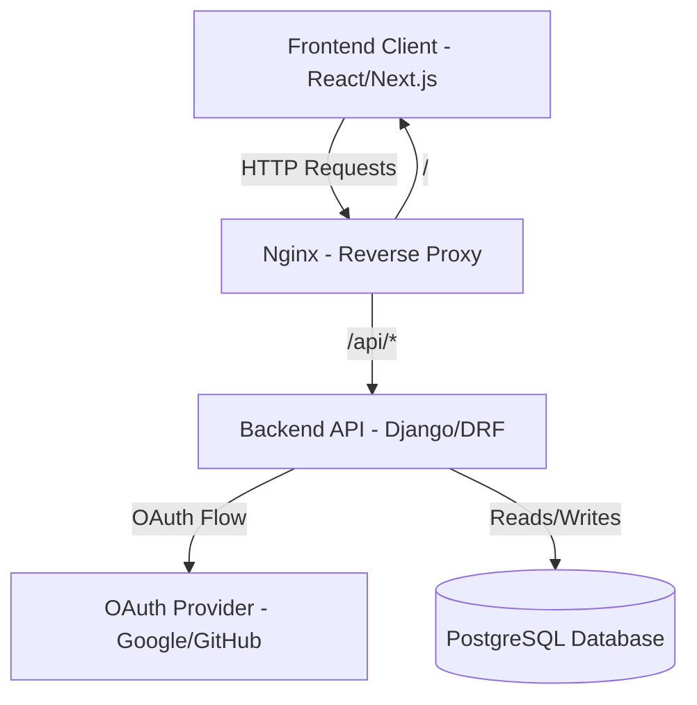
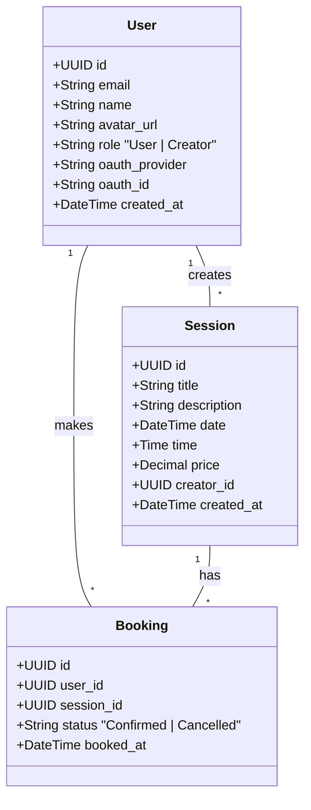

# Ahoum SpiritualTech - Sessions Marketplace

## Overview
A web application where users can sign in via OAuth, browse sessions, and book them. Built with React (or Next.js) for the frontend, Django + Django REST Framework for the backend, and PostgreSQL for the database, all containerized with Docker.

## Tech Stack
- **Frontend**: React / Next.js
- **Backend**: Django + Django REST Framework
- **Database**: PostgreSQL
- **Infrastructure**: Docker (multi-container: frontend, backend, database, Nginx reverse proxy)
- **Authentication**: OAuth (Google or GitHub) with JWT tokens

## Architecture



## Database Schema / Class Diagram



## Setup Instructions

### 1. Cloning the Repository
```bash
git clone https://github.com/yourusername/ahoum-sessions-marketplace.git
cd ahoum-sessions-marketplace
```

### 2. Environment Variables
Copy the provided `.env.example` to `.env` and fill in the necessary values.

```bash
cp .env.example .env
```
Ensure you have set the appropriate `OAUTH_CLIENT_ID`, `OAUTH_CLIENT_SECRET`, database credentials, and other environment variables required in the `.env` file.

### 3. Docker Commands
Start the entire system with a single command:
```bash
docker-compose up --build
```
This will spin up:
- Frontend
- Backend API
- Reverse proxy (Nginx)
- PostgreSQL database

## OAuth Client Setup
To allow users to log in with OAuth (Google or GitHub):
1. **Google**: Go to the [Google Cloud Console](https://console.cloud.google.com/). Create a new OAuth 2.0 Client ID.
2. **GitHub**: Go to [GitHub Developer Settings](https://github.com/settings/developers). Create a new OAuth App.
3. Set the authorized redirect URI to match your backend or frontend callback handler (e.g., `http://localhost/api/auth/callback/`).
4. Copy the generated `Client ID` and `Client Secret` into the `.env` file.

## Example Demo Flow
1. **Login**: Navigate to the Home page and click "Login with Google/GitHub". Upon successful OAuth authentication, the backend issues a JWT.
2. **Create Session (Creator Role)**: Go to the "Creator Dashboard" and click "Create Session". Fill out the session details (title, description, date, time, price) and submit. The session will now appear in the public catalog.
3. **Book Session (User Role)**: Log in as a User, navigate to the Home / Catalog page. Click on a session to view its details on the "Session Detail" page, then hit "Book Now". You can view this active booking in your "User Dashboard".
